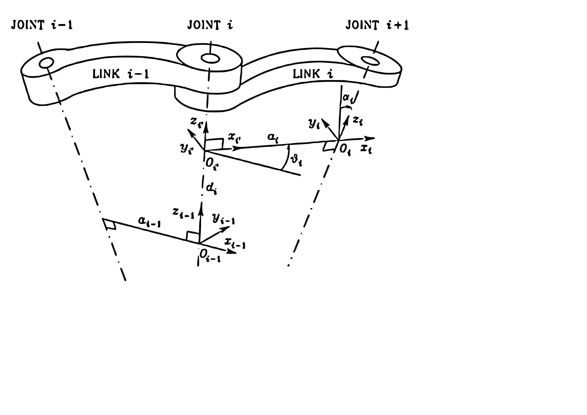

Fondamenti Di Robotica - Lezione 4
==================================

--------------------
## Direct Kinematics  

Ricordiamo un po' di definizioni fondamentali:  
- Un manipolatore consiste di una serie di corpi rigidi chiamati **link** collegati tra loro da **joints** ( giunti ).  
- I **joints** sono di due tipi:
  - **revolute**
  - **prismatic**
- I giunti prismatici si rappresentano graficamente con dei parallelepipedi, mentre i giunti revolute con dei cilindri.  

Dato un frame di riferimento $O_b-x_by_bz_b$ attaccato alla base ed un frame di riferimento $O_e-x_ey_ez_e$ attaccato all'end-effector, la posa dell'end-effector è data dalla matrice di trasformazione omogenea $T_e^b(q)$, dove $q$ è il vettore n-dimensionale di valori dei giunti.  

$$T_e^b(q) = \begin{bmatrix} R_e^b(q) & p_e^b(q) \\ 0 & 1 \end{bmatrix}= \begin{bmatrix} n_e^b(q) & s_e^b(q) & a_e^b(q) & p_e^b(q) \\ 0 & 0 & 0 & 1 \end{bmatrix}$$  

Dove $n_e,s_e,a_e$ sono i vettori unitari associati all'end-effector e sono scelti basandosi sulla sua geometria.  
Per esempio se l'end-effector è un gripper avremo che $a_e$ è scelto in base alla direzione di approccio, $s_e$ in base alla direzione di scorrimento del gripper, $n_e$ è ortogonale agli altri due in modo che il frame $(n_e,s_e,a_e)$ sia destrorso.  

Tutti gli elementi della matrice sono funzioni dei valori dei giunti, quindi $T_e^b(q)$ è una funzione di $q$.  

Nei casi più semplici possiamo calcolare $T_e^b(q)$ in modo analitico, attraverso alcune considerazioni geometriche. Per esempio nel caso di un manipolatore planare a due link:   

  

Possiamo calcolare $T_e^b(q)$:  
$$ T_e^b(q) = \begin{bmatrix} n_e^b & s_e^b & a_e^b & p_e^b \\ 0 & 0 & 0 & 1 \end{bmatrix} = \begin{bmatrix} 0 & s_{12} & c_{12} & a_1c_1+a_2c_{12} \\ 0 & -c_{12} & s_{12} & a_1s_1+a_2+c_{12} \\ 1 & 0 & 0 & 0 \\ 0 & 0 & 0 & 1 \end{bmatrix} $$  

Ove $s_i=\sin(\theta_i)$, $c_i=\cos(\theta_i)$, $s_{12}=\sin(\theta_1+\theta_2)$, $c_{12}=\cos(\theta_1+\theta_2)$.  

In casi più complessi la derivazione può essere molto più difficile, per cui dobbiamo trovare una soluzione generale al problema.  

Prendendo in considerazione un manipolatore generico di $n+1$ link e $n$ giunti. Attacchiamo ad ogni giunto un frame di riferimento dove la posa del frame $i+1$ sarà determinata da una semplice trasformazione dal frame $i$.  
L'idea è che possiamo ricostruire la trasformazione $T_e^b(q)$ in modo ricorsivo.  

$$T_n^0(q)=A_1^0(q_1)A_2^1(q_2)...A_n^{n-1}(q_n)$$  

Ove $A_i^{i-1}(q_i)$ è una trasformazione omogenea funzione di $q_i$ che porta dal frame $i-1$ al frame $i$.  
Per completare il calcolo dobbiamo considerare anche la trasformazione dalla base al primo link e dall'ultimo link all'end-effector che tipicamente sono costanti:  

$$T_e^b(q)=T_0^bT_n^0(q)T_e^n$$  

--------------------------------
## Denavit-Hartenberg Convention  

La convenzione Denavit-Hartenberg è una convenzione per rappresentare i manipolatori in modo da poter calcolare la trasformazione $T_e^b(q)$ in modo semplice ed automatico.  

  

Supponiamo che l'asse $i$ sia la linea immaginaria che attraversa il giunto $i+1$ connettendolo al link $i$.  
L'asse $z_i$ viene scelto allineato a tale asse $i$, dobbiamo ancora definire la posizione di $O_i$ e di $x_i,y_i$.  
Definiamo quindi la **normale comune** a due linee come la linea contenente il segmento di distanza minima tra le due linee; è quindi unicamente definita solo se le due linee sono non coplanari, e ce ne sono infinite se le linee sono parallele, mentre equivale ad un punto se le linee si intersecano.  

Il punto di $O_i$ è definito come l'intersezione tra la normale comune e l'asse $z_i$.  
L'asse $x_i$ è scelto lungo la normale comune nella direzione da $z_{i-1}$ a $z_i$.  
L'asse $y_i$ è scelto in modo che il frame $O_i-x_iy_iz_i$ sia destrorso ($y_i=z_i\times x_i$).  

Situazioni indeterminate:  
- Nel frame $0$ solo $z_0$ è definito, Quindi la posizione di $O_0$ e la direzione di $x_0$ possono essere scelte arbitrariamente.  
- Nel frame $n$ non esiste il giunto $n+1$ quindi $z_n$ non è definito unicamente. L'asse $x_n$ rimane normale all'asse $z_{n-1}$ ed essento il giunto $n$ tipicamente un giunto revolute, porremmo $z_n$ allineato a $z_{n-1}$.  
- Quando due assi sono paralleli non esiste una normale comune.  
- Quando due assi si intersecano non esiste una definizione unica di $x_i$.  
- Quando il giunto è prismatico la direzione di $z_{i-1}$ è arbitraria.  

In tutte queste situazioni proviamo a fare scelte che ci semplificheranno la procedura (per esempio scegliere assi paralleli per frame consecutivi).  

--------------------------------
## Denavit-Hartenberg Parameters  

Poniamo $O_{i'}-x_{i'}y_{i'}z_{i'}$ frame parallelo al frame $O_{i-1}-x_{i-1}y_{i-1}z_{i-1}$. [ Fare riferimento all'immagine precedente ]  

Definiamo quindi i parametri di Denavit-Hartenberg:  
- $a_i$ : distanza tra $O_i$ ed $O_{i'}$  
- $d_i$ : coordinata di $O_{i'}$ lungo l'asse $z_{i-1}$, dal punto di vista di $O_{i-1}$ ( ossia la coordinata $z$ di $O_{i-1}$ è $0$ )  
- $\alpha_i$ : angolo tra $z_{i-1}$ e $z_i$ attorno a $x_i$ ( positivo se antiorario )  
- $\theta_i$ : angolo tra $x_{i-1}$ e $x_i$ attorno a $z_{i-1}$ ( positivo se antiorario )  

Notiamo subito che $a_i$ e $\alpha_i$ sono parametri costanti che dipendono dalla geometria dei link del manipolatore mentre $d_i$ e $\theta_i$ sono parametri variabili che dipendono dalla posizione del manipolatore ($\theta_i$ per giunti revolute e $d_i$ per giunti prismatici).  

Poste tutte queste premesse possiamo definire la trasformazione $A_i^{i-1}(q_i)$ dal frame $i-1$ al frame $i$ come:  

$$A_i^{i-1}(q_i)=A_{i'}^{i-1}A_i^{i'}=\begin{bmatrix} c_{\theta_i} & -s_{\theta_i}c_{\alpha_i} & s_{\theta_i}s_{\alpha_i} & a_ic_{\theta_i} \\ s_{\theta_i} & c_{\theta_i}c_{\alpha_i} & -c_{\theta_i}s_{\alpha_i} & a_is_{\theta_i} \\ 0 & s_{\alpha_i} & c_{\alpha_i} & d_i \\ 0 & 0 & 0 & 1 \end{bmatrix}$$  

A questo punto non ci resta altro che moltiplicare tutte queste matrici ricavate dai vari giunti per ottenere $T_e^b(q)$.  

[ Pagina 19/41 ]  
