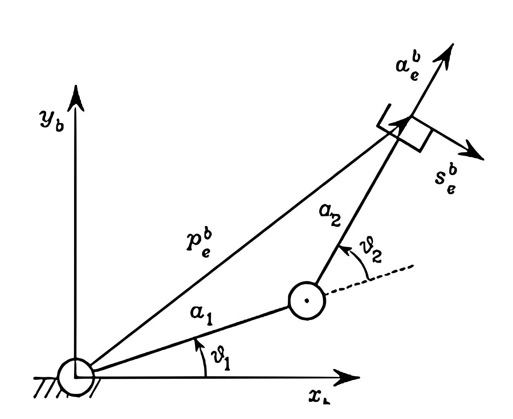

Fondamenti Di Robotica - Lezione 6
==================================

-----------------
## Vector Product  

Prima di tutto ricordiamoci come funzione il prodotto vettoriale "$\times$" tra due vettori.  
Presi $A=\begin{bmatrix} a_x \\ a_y \\ a_z \end{bmatrix}$ e $B=\begin{bmatrix} b_x \\ b_y \\ b_z \end{bmatrix}$, il prodotto vettoriale è dato da:  

$$C=\begin{bmatrix} c_x \\ c_y \\ c_z \end{bmatrix}=\begin{bmatrix}a_yb_z-a_zb_y \\ a_zb_x-a_xb_z \\ a_xb_y-a_yb_x \end{bmatrix}$$  

Se i due vettori sono coda a coda e formano un angolo $\theta$, allora la norma di $C$ è data da:  

$$||C||= ||A||\cdot||B||\sin\theta$$  

Inoltre sappiamo che $C$ è ortogonale al piano contenente $A$ e $B$ e la sua direzione è data dalla regola della mano destra.  

Proprietà del prodotto vettoriale:  
- è non associativo: $A\times(B\times C)\neq (A\times B)\times C$  
- è anticommutativo: $A\times B=-B\times A$  
- matrice skew-simmetrica: $C=-C^T$  

--------------------------
## Angular Velocity Vector  

Consideriamo una particella che si muove di moto rotatorio attorno ad un asse. Definiamo la velocità angolare come:  
$$\omega=\frac{d\theta}{dt}$$  
Se consideriamo un moto attorno un cerchio di raggio $r$, abbiamo che:  
$$s=r\theta$$  
$$v_s=\frac{ds}{dt}=r\dot{\theta}=r\omega$$  
Dato il vettore velocità di una particella che ruota attorno ad un asse arbitrario definiamo $\omega$ come:  
$$\omega=\frac{d\theta}{dt}=\frac{1}{r^2}r\cdot v$$  
Per definizione $\omega$ è ortogonale al piano di rotazione e la sua direzione è data dalla regola della mano destra.  
Preso un vettore velocità $v$ di direzione arbitraria, possiamo dire che:  
$$||\omega||=\frac{1}{r^2}||r\times v||=\frac{1}{r^2}rv\sin\phi=\frac{v_{\perp}}{r}$$  
Ove $v_s=v_{\perp}$ è la componente del vettore velocità che è ortogonale al vettore posizione $r$ e definisce una rotazione istantanea.  
Possiamo quindi dire che:  
$$\omega=\frac{d\theta}{dt}$$  
$$ds=d\theta\times r$$  
$$v_s=\omega\times r$$  

--------------------------
## Differential Kinematics  

Abbiamo visto precedentemente come il robot cambia la posizione dell'end effector in funzione dei valori dei giunti.  
Ora vedremo come la velocità dell'end effector cambia in funzione delle velocità dei giunti.  
Vedremo che questa relazione è lineare grazie al concetto di **Jacobiano.**  
Partiamo dalla semplice equazione:  
$$x(t)=f(\theta(t))$$  
$$\frac{d}{dt}x(t)=\frac{d}{dt}f(\theta(t))$$  
$$\dot{x}=\frac{\partial f}{\partial\theta}\dot{\theta}$$  
Ove $\frac{\partial f}{\partial\theta}$ è la matrice Jacobiana:  

$$J=\frac{\partial f}{\partial\theta}=\begin{bmatrix} \frac{\partial f_1}{\partial \theta_1} & ... & \frac{\partial f_1}{\partial \theta_n} \\ \vdots & \ddots & \vdots \\ \frac{\partial f_m}{\partial \theta_1} & ... & \frac{\partial f_m}{\partial \theta_n} \end{bmatrix} \in \R^{m\times n}$$  

-------------------------------
## Two Link Manipulator Example  

  

Prendiamo un semplice manipolatore planare a due giunti le cui equazioni di cinematica sono:  

$$x_1=L_1\cos\theta_1+L_2\cos(\theta_1+\theta_2)$$  
$$x_2=L_1\sin\theta_1+L_2\sin(\theta_1+\theta_2)$$  

Deriviamo quindi le due equazioni rispetto al tempo per ottenere le velocità:  

$$v_{tip}=\begin{bmatrix} \dot{x_1} \\ \dot{x_2} \end{bmatrix}=\begin{bmatrix} -L_1\sin\theta_1-L_2\sin(\theta_1+\theta_2) \\ L_1\cos\theta_1+L_2\cos(\theta_1+\theta_2) \end{bmatrix}\dot{\theta_1}+\begin{bmatrix} -L_2\sin(\theta_1+\theta_2) \\ L_2\cos(\theta_1+\theta_2) \end{bmatrix}\dot{\theta_2}$$  
$$v_{tip}=J_1(\theta)\dot{\theta_1}+J_2(\theta)\dot{\theta_2}=\begin{bmatrix} J_1 & J_2 \end{bmatrix}\begin{bmatrix} \dot{\theta_1} \\ \dot{\theta_2} \end{bmatrix}=J(\theta)\dot{\theta}$$  
